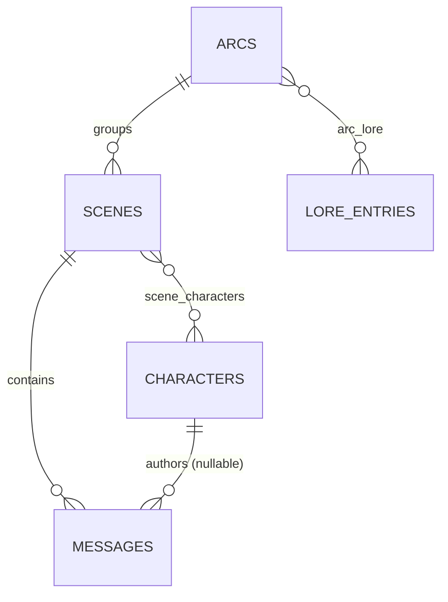

# Calliope — DB Schema bozza (Scene as Chat)

> Schema relazionale target per la fase P1+. Non sostituisce il DB attuale — da migrare per fasi.

---

## Tabelle

### `arcs`
Raggruppamento logico di scene (Arc = folder/gruppo narrativo).

| Colonna | Tipo | Note |
|---------|------|------|
| id | UUID PK | |
| title | TEXT NOT NULL | |
| description | TEXT | |
| created_at | TIMESTAMP | |
| updated_at | TIMESTAMP | |

---

### `scenes`
Chat multi-personaggio — core del sistema.

| Colonna | Tipo | Note |
|---------|------|------|
| id | UUID PK | |
| arc_id | UUID FK→arcs(id) NULLABLE | scene senza arc = non raggruppata |
| title | TEXT NOT NULL | |
| location | TEXT | ambientazione corrente scena |
| is_readonly | BOOLEAN DEFAULT FALSE | TRUE per scene legacy da dataset vecchi |
| created_at | TIMESTAMP | |
| updated_at | TIMESTAMP | |
| last_activity_at | TIMESTAMP | per sorting Dashboard |

---

### `characters`
Schede personaggio — Character Card V2/V3 compatible.

| Colonna | Tipo | Note |
|---------|------|------|
| id | UUID PK | |
| name | TEXT NOT NULL | |
| card_json | JSONB | V2/V3 open spec (stats, backstory, traits, speech patterns) |
| image_path | TEXT | path immagine locale |
| kind | TEXT CHECK IN ('operator','player','npc') | tipo partecipante |
| created_at | TIMESTAMP | |
| updated_at | TIMESTAMP | |

---

### `scene_characters`
Junction: quali personaggi partecipano a quale scena.

| Colonna | Tipo | Note |
|---------|------|------|
| scene_id | UUID FK→scenes(id) | |
| character_id | UUID FK→characters(id) | |
| role | TEXT DEFAULT 'participant' | es. protagonist, narrator |
| joined_at | TIMESTAMP | |
| **PK** | (scene_id, character_id) | |

---

### `messages`
Log cronologico messaggi di una scena.

| Colonna | Tipo | Note |
|---------|------|------|
| id | UUID PK | |
| scene_id | UUID FK→scenes(id) | |
| character_id | UUID FK→characters(id) NULLABLE | NULL per messaggi Discord senza char mappato |
| author_name | TEXT | denorm per discord scraping |
| content_original | TEXT | draft operatore o scraping raw |
| content_enhanced | TEXT NULLABLE | uscita post-AI enhance |
| ts | TIMESTAMP NOT NULL | timestamp messaggio |
| source | TEXT CHECK IN ('manual','discord_scrape','ai_draft') | |
| position_order | INT | ordinamento esplicito in scena |
| is_summary | BOOLEAN DEFAULT FALSE | TRUE = auto-summarize di un range precedente |

---

### `lore_entries`
Knowledge base editabile operator-curata.

| Colonna | Tipo | Note |
|---------|------|------|
| id | UUID PK | |
| category | TEXT CHECK IN ('world_setting','places','characters_events','mechanics_magic','other') | |
| title | TEXT NOT NULL | |
| content_text | TEXT | testo libero, editabile inline |
| created_at | TIMESTAMP | |
| updated_at | TIMESTAMP | |
| created_by | TEXT DEFAULT 'operator' | |

---

### `arc_lore`
Junction: quali voci lore sono associate a un Arc.

| Colonna | Tipo | Note |
|---------|------|------|
| arc_id | UUID FK→arcs(id) | |
| lore_entry_id | UUID FK→lore_entries(id) | |
| **PK** | (arc_id, lore_entry_id) | |

---

## Relazioni

- `arcs` 1-N `scenes` (arc raggruppa scene)
- `scenes` N-M `characters` via `scene_characters` (una scena ha più personaggi, un char in più scene)
- `scenes` 1-N `messages` (history scena)
- `characters` 1-N `messages` (autore nullable — messaggi Discord senza char mappato)
- `arcs` N-M `lore_entries` via `arc_lore` (lore contesto per arc)

---

## ER Diagram

---

## Note migrazione

- **Scene flat files** (`scenes/<id>.md`) → tabella `scenes` + `messages` (split per messaggio)
- **Character YAML** (`characters/<nome>.yaml`) → `characters.card_json` (JSONB, operator rivedere pre-import)
- **Lore MD** (`lore/<topic>.md`) → `lore_entries` per categoria (operatore ri-cura manualmente — NO import automatico)
- **ChromaDB index** — resta per ricerca semantica second-step (affianca schema SQL, NON sostituito)
- **Scene legacy** (dataset vecchi) → import con `is_readonly=TRUE`, sola consultazione, NON editing
- Migrazione è per fasi: P1 introduce tabelle scenes+messages → P3 lore_entries → P4 characters
