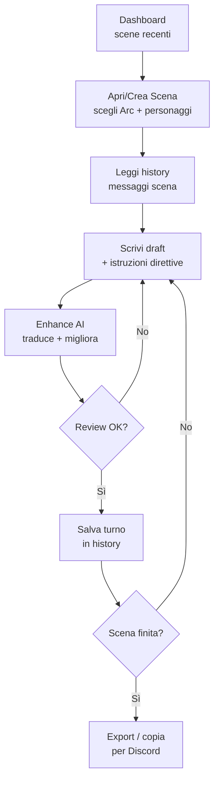

# Calliope — User Flow Operatore

---

## Flow principale — "Happy path: nuova sessione di gioco"

| Step | Superficie | Azione operatore |
|------|-----------|-----------------|
| 1 | Dashboard | Apri app → visualizza scene recenti + messaggi scraped recenti |
| 2 | Scenes | Crea o apri una scena → seleziona Arc (o crea nuovo) → aggiungi personaggi dal roster Characters |
| 3 | Scenes / History | Leggi history scena (scroll messaggi, newest bottom) |
| 4 | Scenes / Draft | Scrivi primo draft risposta (IT o EN) nel campo draft + compila campo istruzioni direttive (stile/tono/direttive narrative) |
| 5 | Scenes / Enhance | Lancia enhance → AI genera uscita singola tradotta+migliorata → review + edit manuale se necessario |
| 6 | Scenes / Save | Salva turno → messaggio appare in history con character assegnato |
| 7 | Loop / Export | Ripeti dal passo 4 finché scena completata → Export/copia testo per Discord |

---

## Diagramma — Happy path



---

## Flow secondario — "Aggiorna Lore dopo una sessione"

1. Vai in **Lore KB** → seleziona categoria appropriata (World/Setting, Places, Characters & Events, Mechanics, Other)
2. Cerca voce esistente o crea nuova
3. Edita `content_text` direttamente nel browser
4. Salva → voce disponibile in context per future scene

---

## Flow secondario — "Scraping Discord"

*(Separato dal happy path — non bloccante, si esegue quando online/disponibile)*

1. Vai in **Messages** → trigger scraping incrementale (solo messaggi nuovi dall'ultimo scraping)
2. Visualizza nuovi messaggi per canale
3. Seleziona messaggi da appendere → scegli scena target
4. Conferma append → messaggi entrano in scena con `source='discord_scrape'`

---

## Edge cases

**Scena molto lunga (context budget exceeded)**
Quando i token della history superano la soglia budget (finestra modello − riserva risposta), il sistema auto-summarizza il range di messaggi più vecchi in una "memory note" (`is_summary=TRUE`). L'operatore può rivedere e editare il summary prima che venga usato come context nella prossima chiamata AI.

**Character offline / turno saltato**
Se un personaggio non risponde in un turno, l'operatore salta senza inserire messaggi per quel char e continua. Nessuna cerimonia richiesta.

**Lore reference inline**
Durante la scrittura del draft, l'operatore può lanciare una ricerca lore (panel laterale o shortcut) senza lasciare la scena. Canonical entries first, poi vector search opzionale su dataset.

**Modello non disponibile (auto-rotate)**
Se il modello AI restituisce `model-not-found` con chiave valida → Efesto (P6) seleziona automaticamente il modello vivo successivo dello stesso provider e aggiorna la config. Nessun intervento operatore richiesto. Se tutte le chiavi di tutti i provider falliscono per X giorni → avviso all'avvio del CLI.

---

## Context assembler — priorità budget

```
Budget disponibile = finestra_modello − riserva_risposta

Slot 1 (ALWAYS):   schede character partecipanti (card_json) + istruzioni direttive scena
Slot 2 (FILL):     messaggi recenti verbatim (newest first, fino a budget)
Slot 3 (COMPRESS): messaggi vecchi → auto-summarize compresso
```

La compressione slot 3 è automatica ma il summary risultante è editabile dall'operatore prima dell'uso.
